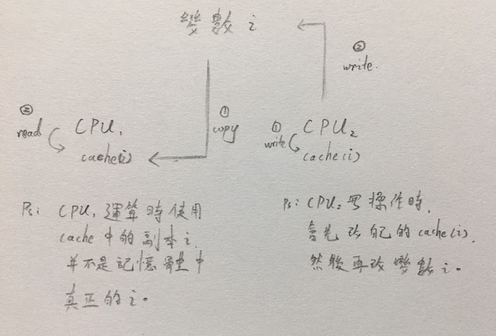
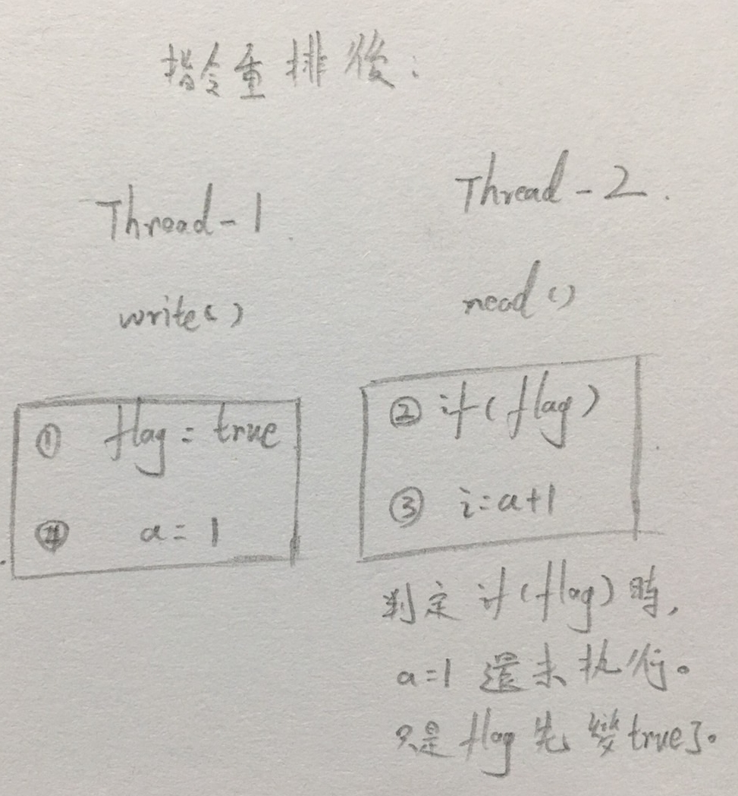

# Java内存模型（Java Memory Model，__JMM__）-> 原子性( Atomicity )、可見性( Visibility )、有序性( Ordering )

<br>

--------------

<br>

JMM 保證 Thread 間可以有效正確協作，JMM 關鍵點都是圍繞 原子性( Atomicity )、可見性( Visibility )、有序性( Ordering ) 建立的，下面一一介紹這些概念。

<br>
<br>

## 原子性( Atomicity )

<br>

原子性指一個操作是不可中斷的，多 Thread 一起執行時，一個操作一旦開始就不會被其他人干擾。

舉例來說有一個變數 `static int i = 0`，有兩個 Thread 對他進行修改，Thread-1 修改為 `i=1` Thread-2 修改為 `i=2`，那麼 `i` 必定不是 1 就是 2，這就是原子性。或許看到這邊你會想說 " 阿不就是 1 或 2 嗎 ? 還會是甚麼 ? 如果今天 `int` 換成 `long` 型態就會出問題。

對於 32 位元系統來說 `long` 型態資料讀寫就不是原子性 ( 因為 `long` 有 64 位元 )，如果多個 Thread 對它進行寫操作就會發生干擾。

如果有 4 個 Thread 對 `long t` 進行修改，分別修改為 `111`、`-999`、`333`、`444`，然後用一個 Thread 執行讀 `t` 的任務，在 32 位元的系統中實際讀到的 `t` 值可能會亂七八糟，像這樣：

<br>

code : 


```java
package com.frizo.lab.thread.mysticism.aboutJMM;

public class MultiThreadLong {

    public static long t = 0;

    // 寫任務
    public static class ChangeT implements Runnable {

        private long to;

        public ChangeT(long to){
            this.to = to;
        }

        @Override
        public void run() {
            while (true) {
                MultiThreadLong.t = to;
                Thread.yield();
            }
        }
    }

    // 讀任務
    public static class ReadT implements Runnable {

        @Override
        public void run() {
            while (true) {
                long temp = MultiThreadLong.t;
                if (temp != 111L && temp != -999L && temp != 333L && temp != -444L) {
                    System.out.println("abnormal value: " + temp);
                }
                Thread.yield();
            }
        }
    }

    public static void main(String[] args) {
        new Thread(new ChangeT(111L)).start();
        new Thread(new ChangeT(-999L)).start();
        new Thread(new ChangeT(333L)).start();
        new Thread(new ChangeT(-444L)).start();

        new Thread(new ReadT()).start();
    }

}

```

<br>

output :

<br>

```
abnormal value: -4294966963
abnormal value: 4294966852
abnormal value: -4294966963
...
```

<br>

解釋一下，首先我們先把 `111`、`-999`、`333`、`444` 轉換成 64 位元大的 2 進制來表示（`long` 型態佔 64 位）：

```
111          = 0000000000000000000000000000000000000000000000000000000001101111
-999         = 1111111111111111111111111111111111111111111111111111110000011001
333          = 0000000000000000000000000000000000000000000000000000000101001101
-444         = 1111111111111111111111111111111111111111111111111111111001000100
4294966852L  = 0000000000000000000000000000000011111111111111111111111001000100
-4294966963L = 1111111111111111111111111111111100000000000000000000000101001101
```

<br>

其實簡單說就是 32 bit 系統硬體上有 32 個 bus 匯流排，寫動作一次可以寫 32 bit，那麼寫一個 64 bit 的 `long` 型態資料就要 __寫 2 次__，多執行緒對 `i` 做寫動作的話可能第一個 Thread 寫了 `111` 的前 32 位，然後第二個 Thread 馬上接著寫入了 `-444` 的後 32 位，然後就形成了我們看到所謂的 `4294966825` 之類的亂數。

__注意 ! 只有在 32 bit 的系統下才會有這種情形，現在大部分電腦都是 64 bit 了，所以這段 code 只是說明一下原子性問題而已。僅供參考。__

<br>
<br>
<br>
<br>

## 可見性( Visibility )

<br>

可見性指當一個 Thread 修改了某一個共享資料值後，其他 Thread 是否能馬上知道這個修改。對於串行程式而言，可見性問題不存在，因為改完數值後，後續邏輯讀取這個資料單位，一定是修改後的值。

如果你沒有寫過一些多 Thread 的程式，可能對可見性問題抱有一種懷疑態度，你可能會說 : " Thread-1 改了 `i` 數值，使 `i = 1`，那其他 Thread 不是就應該讀出來 `i` 就應該是 1 嗎 ? " 我們就這個問題來說明一下 __緩存優化__。

對高中計算機概論有一點印象的人應該記得 CPU 有 __[暫存器（Register）](https://zh.m.wikipedia.org/zh-tw/%E5%AF%84%E5%AD%98%E5%99%A8)__ 這個東西，假如今天有 2 個 CPU 要對變數 `i` 做運算操作，由於每次讀取操作都要去記憶體中讀 `i` 的話非常浪費時間，所以緩存優化下會將變數 `i` 另存一個副本到每個 CPU 的緩存器中，這大大的加速的運算效率 ( 畢竟不用大老遠跑去記憶體拿變數 `i` 的值)，但是衍伸出的問題就是在多執行緒下的寫操作，某個負責寫操作的 CPU 完成變數 `i` 寫入記憶體的動作後，其他 CPU 並不知道記憶體中的 `i` 已經改變了，仍然繼續使用 cache 中的舊值。這就是可見性問題。如下圖：




<br>
<br>
<br>
<br>

## 有序性( Ordering )

<br>

有序性問題非常重要，這裡面有關於 JVM 設計的奧秘之一 __指令重排__。

<br>

首先看看指令重排的定義：

>Java 語言規範規定 JVM 執行緒內部維持順序化語義。即只要程式的最終結果 與它順序化情況的結果相等，那麼指令的執行順序可以與代碼順序不一致，此過程叫指令的 __重排序__。

>JVM 能根據處理器特性 ( CPU 多級緩存系統、多核處理器等 ) 適當的對機器指令進行重排序，使機器指令能更符合 CPU 的執行特性，最大限度的發揮機器性能。

<br>

對指令重排沒概念的人，可能對他的定義會有點看不懂，接下來就詳細解釋一下指令重排。

<br>

首先來看一下指令重排可能會造成的問題，有一段 code 如下。

code：

```java
public class OrderExample {

    int a = 0;
    boolean flag = false;

    public void write() {
        a = 1;
        flag = true;
    }

    public void read() {
        if (flag) {
            int i = a + 1;
        }
    }

}
```

<br>

假如 Tread-1 先執行 `write()` Thread-2 接著執行 `read()`，如果發生指令重排，那麼 Thread-2 在執行 `read()` 時，即使通過了 `flag` 的判定也不一定能看到 `a` 已經被賦予值為 `1`。

這個問題看起來似乎很扯，但他真的存在，下面看一下當發生指令重排後的邏輯概念圖 ( Thread-1 指令發生重排 )：

<br>



<br>

指令是否重排，如何重排是我們沒辦法預測的，Thread-1 指令的執行順序在 Thread-2 看來是無法保證的。但是要強調一點，在單一個 Thread 角度看來，指令重排後，絕對不會影響原本的邏輯與語意，例如只站在 Thread-1 角度來看，即使調換指另也對這個 Thread 運算結果沒有任何影響。

```java
{
    a = 1;
    flag = true;
}

// 調換之後也沒有任何影響，都只是給值動作而已。

{
    flag = true;
    a = 1;
}

```

但是就因為這樣的重排，就會影響到 Thread-2 的語意邏輯。這就是多 Thread 下的指令重排問題。__指令重排可以保證串行語意一至，但沒有義務保證多執行緒間語意一致__。

<br>

那麼問題來了，指令為何要沒事重排呢 ? 該怎樣執行就怎樣執行不就好了嗎 ? 之所以要指令重排完全是因為效能考量，我們先把一個指令的執行動作拆解來看。

一個指令可以分成以下 5 個動作（[__指令管線化__](https://zh.m.wikipedia.org/zh-tw/%E6%8C%87%E4%BB%A4%E7%AE%A1%E7%B7%9A%E5%8C%96)）：

* 讀取指令（IF）

* 指令解碼與讀取暫存器（ID）

* 執行（EX）

* 記憶體存取（MEM）

* 寫回暫存器（WB）

<br>

以上每個步驟所使用到的硬體也不同，例如讀取指令要用到 PC 暫存器，指令解碼與讀取暫存器要用到指令暫存器，執行時用到 ALU 等等。

每一個步驟都可能用到不同硬體，所以就有天才發明了 __指令管線化__。例如：

<br>

```
指令 1 : IF  ID  EX  MEM  WB

指令 2 : 空  IF  ID  EX  MEM  WB
```

<br>

當指令 2 開始執行時，指令 1 還沒執行完，準確來說指剛完成取指 ( IF ) 動作而已。

假設每一個步驟都需要使用 1 毫秒，那指令 2 等指令 1 完成後再跑，要先等 5 毫秒，而使用指令管線化，只需要等 1 毫秒 ( 指令 1 執行完 IF ) 就可以執行了。__美妙的設計__。

<br>

那麼問題來了，這跟指令重排有甚麼關係？指令管線化有一個大的缺陷，就是害怕中斷，一旦中斷。所有後續步驟都會延宕，性能損失極大。來看一個簡單例子，說明一下中斷情況：

<br>

我們拆解一下 `A = B + C` 這個例子。

<br>

```
A = B + C 拆解 （注：R1 R2 是暫存器）

#1 把 B load 到 R1    IF  ID  EX  MEM  WB
#2 把 C load 到 R2        IF  ID  EX  MEM  WB
#3 ADD R1 R2 到 R3            IF  ID  (X)  EX  MEM  WB
#4 R3 儲存到 A                    IF  (X)  ID  EX  MEM  WB
```

<br>

可以看到 #3 執行 ADD 時，出現一個延宕 (X)，因為 R2 的值此時還沒有準備好，所以 ADD 操作必須等一下，導致後面所有指令都慢一拍。

<br>

為解決這個問題，於是就要指令重排。但是上面這個例子沒辦法重排（已經最佳化了），下面舉一個可以重排的例子。指令如下：

```
a = b + c

d = e - f
```

<br>

```
a = b + c

d = e - f

( 注: R 是暫存器 )

#1 把 a load 到 Rb    IF  ID  EX  MEM  WB
#2 把 c load 到 Rc        IF  ID  EX  MEM  WB
#3 ADD Rb Rc 到 Ra            IF  ID  (X)  EX  MEM  WB
#4 Ra 儲存到 a                     IF  (X)  ID  EX  MEM  WB
#5 把 e load 到 Re                 (X)  IF  ID  EX  MEM  WB
#6 把 f load 到 Rf                          IF  ID  EX  MEM  WB
#7 SUB Re Rf 到 Rd                              IF  ID  (X)  EX  MEM  WB
#8 Rd 儲存到 d                                      IF  (X)  ID  EX  MEM  WB
```

<br>

試著人工重排來減少延宕，同時要保證運算結果要是正確的 !

首先思考，第一次發生延宕是在 #3 處，由於 Rc 還未準備好，所以不能進行 ADD 運算，所以我們換一個不需要運算的步驟到 #3 來。

<br>

第一換 : #5 -> #3

<br>

```
a = b + c

d = e - f

第一換 : #5 -> #3

#1 把 a load 到 Rb    IF  ID  EX  MEM  WB
#2 把 c load 到 Rc        IF  ID  EX  MEM  WB
#5 把 e load 到 Re            IF  ID  EX   MEM  WB
#3 ADD Rb Rc 到 Ra                IF  ID   EX   MEM  WB
#4 Ra 儲存到 a                         IF  ID   EX   MEM  WB
#6 把 f load 到 Rf                          IF  ID   EX  MEM  WB
#7 SUB Re Rf 到 Rd                              IF   ID  (X)  EX  MEM  WB
#8 Rd 儲存到 d                                       IF  (X)  ID  EX   MEM  WB
```

<br>

#7 延宕因為 #6 的 Rf 還沒有準備好，所以把 #6 跟 #4 調換一下。

<br>

第二換 : #6 -> #4

<br>

```
a = b + c

d = e - f

第二換 : #6 -> #4

#1 把 a load 到 Rb    IF  ID  EX  MEM  WB
#2 把 c load 到 Rc        IF  ID  EX  MEM  WB
#5 把 e load 到 Re            IF  ID  EX  MEM  WB
#3 ADD Rb Rc 到 Ra                IF  ID  EX   MEM  WB
#6 把 f load 到 Rf                    IF  ID   EX  MEM  WB
#4 Ra 儲存到 a                            IF   ID  EX  MEM  WB
#7 SUB Re Rf 到 Rd                             IF  ID  EX  MEM  WB
#8 Rd 儲存到 d                                     IF  ID  EX  MEM  WB
```

<br>

重排後，延宕問題直接解決了，運算結果也正確。這就是為何要為何需要指令重排。

<br>
<br>

### 不可以指令重排的情況

<br>

* 順序原則：必須保證單一執行緒語意串行性一致 ( 不可以影響運算結果 )

* volatile 規則：`volatile` 變數的寫操作先發生於讀，保證 `volatile` 變數可見性。
* 鎖規則：解鎖必發生在隨後的上鎖前。

* 傳遞性原則：A 先於 B，B 先於 C，那 A 必先於 C。

* start() 原則：Thread 的 `start()` 方法先於它每個動作。
 
* join() 原則：Thread 所有操作先於終結 `Thread.join()`。

* interrupt() 原則：`interrupt()` 先於被中斷的程式。

* 建構原則：建構函式執行結束先於 `finalize()`。


