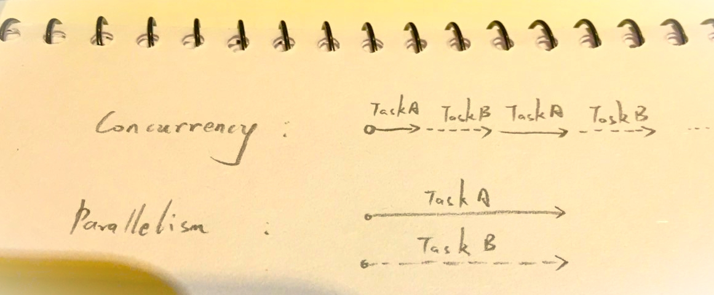

# 並行(Concurrency)、平行(Parallelism)

 

---

 

## 並行(Concurrency)、平行(Parallelism) 解釋

 

並行平行台灣與大陸地區用語會讓人頭暈，建議一律用英文去記。

 

__Concurrency__：兩個以上任務交替進行。從時間線上來看就是所有任務擠在一條線上交替執行。

__Parallelism__：兩個以上任務同時間進行，從時間線上看就像是平行進行。

 

 

Parallelism 才是真正意義上的多執行緒同時執行不同任務，Concurrency 比較像是單一 CPU 交替執行不同任務。

 

實務上，如過機器只有一個 CPU 的話去使用多執行緒開發，那底層執行就不可能是真正的 Parallelism，這種情形下就一定是 Concurrency。真正的 Parallelism 只會出現在多 CPU 的機器上。