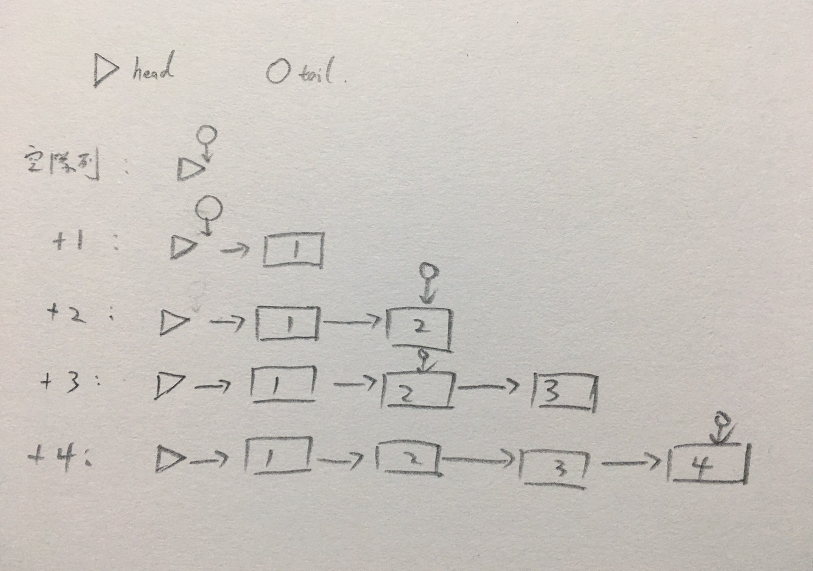

# 解析高效的讀寫隊列：__ConcurrentLinkedQueue__

<br>

---

<br>

JDK 中提供一個 __ConcurrentLinkedQueue__ 類用來實現多執行緒隊列。這個隊列使用鍊表作為其資料結構。事實上，__ConcurrentLinkedQueue__ 應該算是在多執行緒環境下，性能最好的隊列，他之所以能有出色的性能，是因為其內部複雜的實現。

這裡會來解析一下這個複雜的 __ConcurrentLinkedQueue__ 是如何實現的。

<br>

作為一個鍊表（__LinkedList__），當然會有鍊表內的節點（__Node__）。在 __ConcurrentLinkedQueue__ 中，定義的節點如下：

<br>

```java
private static class Node<E> {
    volatile E item;
    volatile Node<E> next;
}
```

<br>

`item` 是用來表示目標元素，比如說，當隊列表中存放 __String__ 時，`item` 就是 __String__ 類。`next` 表示當前 __Node__ 的下一個元素，這樣一來每個 __Node__ 就能環環相扣。

<br>

## __CAS__ 操作

<br>

對 __Node__ 進行操作時，使用 __CAS__ 操作。關於 __CAS__ 到後面鎖優化會詳細說明，這邊稍微簡單的說明一下甚麼是 __CAS__。

<br>

所謂 __CAS__ 就是指 Compare And Swap，使用 __CAS__ 其實就是不使用鎖，所有資源全開任意存取。但是這種肆意存取情況下肯定會出現衝突問題，__CAS__ 避免這個問題的方法是這樣做的：

__CAS__　有三個參數（V, E, N），V 表示要更新的變數，E 表示預期值，N 表示新值。只有當 V 等於 E 時，才會將 V 的值變成 N。如果 V 與 E 不同，則說明已經有其他 Thread 做了更新，最後 __CAS__ 返回當前 V 的真實值。

__CAS__ 操作是抱著樂觀態度進行的，他總是認為自己可以成功完成操作。當多 Thread 操作一個變數時，只會有一個會勝出，並成功更新，其餘均會失敗。失敗的 Thread 被告知失敗後，允許再次嘗試，當然也允許失敗的 Thread 放棄操作。基於這樣的原理，__CAS__ 即使沒有鎖，也可以發現其他 Thread 對當前 Thread 的干擾，並洽當處理。

<br>

## __Node__

<br>

對 __Node__ 進行操作時，使用 __CAS__ 操作如下：

<br>

```java
boolean castItem(E cmp, E val) {
    return UNSAFE.compareAndSwapObject(this, itemOffset, cmp, val);
}

void lazySetNext(Node<E> val) {
    UNSAFE.putOrderedObject(this, nextOffset, val);
}

boolean casNext(Node<E> cmp, Node<E> val) {
    return UNSAFE.compareAndSwapObject(this, nextOffset, cmp, val);
}
```

<br>

`castItem()` 與 `casNext()` 方法是採用一樣的 __CAS__ 方法，一個是設置當前 __Node__，另一個是設置 `next` 的 __Node__。他們都需要 2 個參數 `cmp`（期望值） 與 `val`（設置目標值），當目前值（`this`）等於 `cmp` 時，就會將目標設置為 `val`。

<br>

## __ConcurrentLinkedQueue__

<br>

__ConcurrentLinkedQueue__ 內部有兩個重要的屬性：`head` 和 `tail`。

`head` 代表鍊表的頭部， `tail` 代表尾部，它們所指向的都是 __Node__ 類別。對於 `head` 來說，她永遠不為 null，而對於 `tail` 來說，他表示隊列的末尾。

__ConcurrentLinkedQueue__ 內部實現非常複雜，而且有一些狀態不同步問題。一般來說，我們總覺得 `tail` 是鍊表末端，但實際上 `tail` 的更新並不是即時的，而是可能會產生拖延狀況，他可能每次新增 2 個元素後才更新，如下圖：

<br>



<br>

可以看到 `tail` 並不是一直在更新，接下來要介紹 __ConcurrentLinkedQueue__ 的實現，內容非常硬，看不懂沒關係，但是看懂了你就變強了。

<br>

### `offer()` 方法


<br>

以 JDK 1.7 source code 修改一點變數名稱（可讀性）:

<br>

```java
public boolean offer(E e) {
    final Node<E> newNode = new Node<E>(e);

    for (Node<E> t = tail, pointer = t ;;){
        Node<E> next = pointer.next;
        if(next == null) { // #1 如果 point 是最後一個　(next 為 null)
            if (pointer.casNext(null, newNode)){ // #2
                if (pointer != t) { // #3 pointer 不等於 tail 的情況就是已經領先 tail 一個了
                    casTail(t, newNode); // 更新 tail 位置
                }
                return true;
            }
        } else if (pointer == next) {
            // 如果 tail 被修改，pointer 使用 tail (因為可能被修改正確)
            pointer = (t != (t = tail)) ? t : head;
        }else { 
            // #4 pointer 取成下一個 Node 或最後一個 Node
            pointer = (pointer != t && t != (t = tail)) ? t : next;
        }
    }
}
```

<br>

---

<br>

看不懂很正常，因為這太複雜了，我們盡量理解，能理解多少是多少。首先要解釋一點

```java
pointer = (t != (t = tail)) ? t : head;
```

這裡的 `!=` 並不是原子操作，它可以被中斷，也就是說在執行 `!=` 時，程式會先取得 `t` 值，然後再去執行 `t = tail` 取得新的 `t` 值，也就是變成這樣：

```java
pointer = (當前t != (最新t = tail)) ? 最新t : head;
```

在單 Thread 時， `t != (t = tail)` 這種語句肯定不會成立，但是多 Thread 情況下很有可能在獲得左邊 `t` 後，右邊的 `tail` 馬上就被其他 Thread 修改。這樣以上語句就可以成立。

<br>

---

<br>
<br>

來從頭看一下這個方法吧，這個方法沒有任何鎖操作，Thread Safe 完全由 __CAS__ 操作與演算法保證。整個方法的核心是 `for` 循環，這個循環沒有出口，直到嘗試成功。

當第一次加入元素時，由於隊列為空，此時 `pointer.next` 為 null，邏輯通過 #1 處。

#2 處將 `pointer.next` 設置為本次新增的新 __Node__（也就是真正執行新增動作）。

在此時　`pointer` 還是等於 `t` 的（tail 就是目前最後一個），所以 #3 處是不成立的，因此邏輯不會進到後面的更新 tail 動作。`casNext()` 成功後直接返回，如果失敗舊繼續嘗試。因此，增加一個元素後，`tail` 並不會被更新。

<br>

當新增第二個元素時，此時的 `t` 還在 head 的位置上，因此 `pointer.next` 會指向實際的第一個元素，因此 #1 處的 `next == null` 已經不成立了。

由於往鏈表新增 __Node__ 需要先找到最後一個 __Node__，因此要循環開始查找最後一個 __Node__。此時邏輯來到了 #4 處，獲取最後一個 __Node__。此時 `pointer` 實際上指向鏈表中的第一個元素，而他的 `next` 就變成 null。所以在第二次循環時就成功進入 #1 處邏輯，`pointer` 成功更新自己的 `next`，如果成功，由於此時 #3 處邏輯也通過，所以可以更新 `tail` 了。

<br>
<br>

另外還有 `poll()` 方法，但是我挖不動了，真的太難了......

其實作為一般開發人員，理解大致上的 __CAS__ 機制，直接用 JDK 開發人員實現的工具就好了。真的要提升自己再嘗試去理解看看底層。