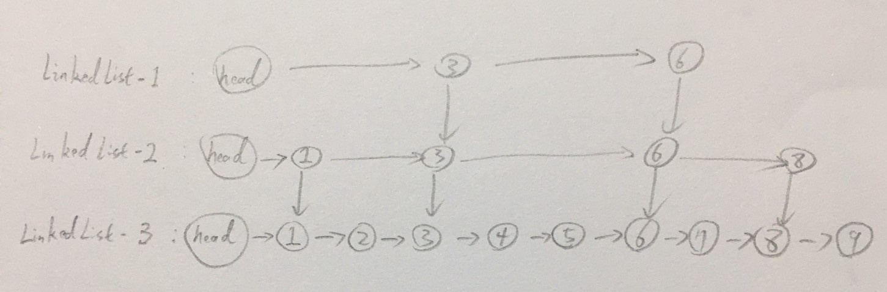
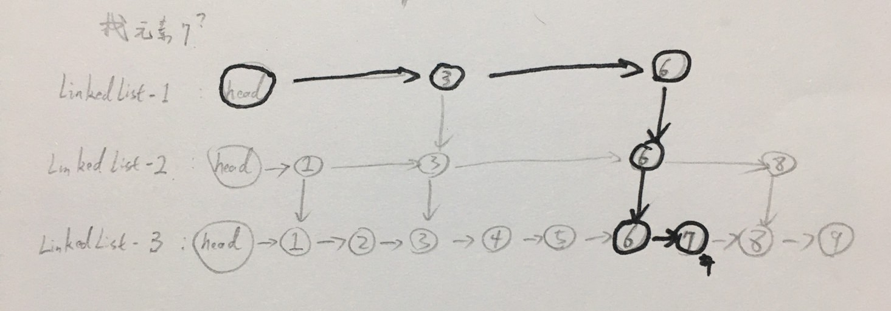

# 隨機資料結構：跳表（SkipList）實現部分鎖

<br>

---

<br>

__跳表是一種可以用來快速查找的資料結構__，功能類似平衡樹（Balanced Binary Tree）。它們有一個主要區別是：對平衡樹的插入刪除會導致其進行一次全局調整，而跳表的插入刪除只需要對整個資料結構 __局部__ 進行調整即可。這樣一來，在多 Thread 情況下，針對跳表我們只需要部份鎖就可以了，不用把資料全鎖起來。這樣一來，我們就可以有更好的多 Thread 性能。

所以在多 Thread 資料結構中，JDK 使用跳表實現 __Map__。

<br>

跳表有一個蠻有趣的特點，就是 __隨機算法__，跳表的本質是同時維護多個鏈表（__LinkedList__），並且鏈表是分層的，像是下面這樣：

<br>



<br>

最底層的 LinkedList-3 維護了跳表中所有的元素，每上面一層的鏈表都是下面一層的子集合，一個元素插入哪一層都是隨機的，因此，如果運氣差的話可能會得到一個性能超差的結構，但是實際使用上，他的表現還是不錯的。

<br>

__跳表維護的所有鏈表元素都是排序好的，查找時可以從最上一層鏈表開始找，如果發現要查找的元素小於當前鏈表中的某值，就直接傳入下一層繼續找（搜索是跳躍式的）。

舉例來說查找元素 7，這邊繼續使用上方的例子做示範：

<br>



<br>

先從頂層鏈表開始找，由於 LinkedList-1 元素較少，所以很快來到 6，後方無值，所以直接跳躍到 LinkedList-2 的元素 6 位置。往後元素 8 大於我們要查找的元素 7，所以無法在這一層找到答案。我們再跳躍到 LinkedList-3 的元素 6 位置，往後一位就是我忙要找的答案 7。整個查找過程比一般鏈表從 1 開始找要快很多。

__跳表是一種用空間換時間的演算法__

<br>

跳表實現 __Map__ 與 Hash 演算法實現的 __HashMap__ 不同之處在於：Hash 不會維護元素的順序，而跳表實現元素全部排列有序，因此我們對跳表遍歷，會得到一個有序的結果。

__如果需要一個有序的多 Thread 應用 Map，跳表實現是不二選擇！__

<br>
<br>
<br>
<br>

JDK 提供了一套跳表實現的 __Map__：__ConcurrentSkipListMap__。下面展示一下使用方法。

<br>

```java
public class SkipListMapDemo {
    public static void main(String[] args) {
        Map<Integer, Integer> map = new ConcurrentSkipListMap<>();
        IntStream.range(0, 30).forEach(i -> {
            map.put(i, i);
        });
        List<Integer> result = new ArrayList<>(map.keySet());
        result.forEach(System.out::println);
    }
}
```

<br>

印出的結果會是排列有序的 0 ~ 29。

<br>
<br>
<br>
<br>

跳表由幾個關鍵資料結構組成，分別是：__Node__、__Index__、__HeadIndex__。

<br>
<br>

### Node

<br>

__Node__ 表示一個節點，裡面有 2 個重要元素 `key` 與 `value`（就是 __Map__ 的 key 與 value）。每個 __Node__ 還要指向下一個 __Node__ `next`。

<br>

```java
static final class Node<K, V> {
    final K key;
    volatile Object value;
    volatile Node<K, V> next;
}
```

<br>

對於 __Node__ 的所有操作都使用 CAS 機制：

<br>

```java
boolean casValue(Object cmp, Object val) {
    return UNSAFE.compareAndSwapObject(this, ValueOffset, cmp, val);
}

boolean casNext(Node<K, V> cmp, Node<K, V> val) {
    return UNSAFE.compareAndSwapObject(this, ValueOffset, cmp, val);
}
```

<br>
<br>


### Index

<br>

__Index__ 表示索引，他內部封裝了 Node，__同時增加向下與向右的引用__。

<br>

```java
static class Index<K, V> {
    final Node<K, V> node;
    final Index<K, V> down;
    volatile Index<K, V> right;
}
```

<br>

整個跳表都是根據 __Index__ 編織而成的。

<br>
<br>


### HeadIndex

<br>

__HeadIndex__ 是每一層的開頭，他繼承 __Index__，新增了記錄當前在哪一層的 `level` 屬性。

<br>

```java
static final class HeadIndex<K, V> extends Index<K, V> {
    final int level;

    HeadIndex(Node<K, V> node, Index<K, V> down, Index<K, V> right, int level){
        super(node, down, right);
        this.level = level;
    }
}
```

<br>
<br>
<br>
<br>

以上就是關於跳表的介紹