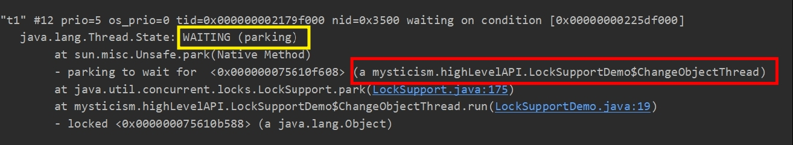

# 取代 `suspend()` 與 `resume()` 的最佳工具：LockSupport

<br>

-------

<br>

回顧第二章節的 __[不要用 `suspend()` 與 `resume()`](https://github.com/Johnny1110/Java-multi-thread-mysticism/blob/main/note/likelyToBeIgnore/suspendAndResume.md)__ 小節。我們知道了為何 JDK 開發團隊不建議我們使用這兩個方法。

LockSupport 為解決這一問題，就以一個高級 API 的身份出現。他合理的解決 `resume()` 在 `suspend()` 前被執行導致的永久性掛起問題。

<br>

先看示範：

<br>

```java
public class LockSupportDemo {

    public static final Object U = new Object();
    public static ChangeObjectThread t1 = new ChangeObjectThread("t1");
    public static ChangeObjectThread t2 = new ChangeObjectThread("t2");

    public static class ChangeObjectThread extends Thread {
        public ChangeObjectThread(String name){
            super.setName(name);
        }

        @Override
        public void run(){
            synchronized (U) {
                System.out.println("in " + this.getName());
                LockSupport.park();
            }
        }
    }

    public static void main(String[] args) throws InterruptedException {
        t1.start();
        Thread.sleep(100);
        t2.start();
        LockSupport.unpark(t1);
        LockSupport.unpark(t2);
        t1.join();
        t2.join();
    }
}
```

<br>

印出結果

<br>

```
in t1
in t2
```

<br>

無論執行幾次，都可以正常結束。下面解釋一下為何能做到解決 `suspend()` 與 `resume()` 做不到的這件事。

<br>

LockSupport 使用類似 Semaphore 的機制，她為每一個 Thread 準備一個許可，假設這個許可是一個 `boolean` 值，當 `park()` 時檢查這個 `boolean`，為 true 時立刻返回（相當於 `park()` 無效），並更改 `boolean` 為 false（消費這個信號）。如果 `park()` 時發現 `boolean` 為 false，則阻塞。`unpark()` 時則會將這個 `boolean` 變成 ture，並嘗試讓 Thread 繼續執行。

所以這樣一來，假設 `unpark()` 先於 `park()` 執行了，`park()` 由於發現 `boolean` 為 ture 所以直接返回不執行掛起動作。這就是 LockSupport 的奧秘。

<br>

同時，處於 `park()` 的掛起狀態 Thread 不會像 `suspend()` 那樣仍然是 RUNNABLE 狀態。他會明確給出一個 WAITING 狀態，甚至標註是 `park()` 引起的。

此外，如果你使用 `park(Object)` 的話，還可以為當前 Thread 綁定一個阻塞對象，這樣分析問題時會更加方便。

我們嘗試把 `park()` 改一下：

<br>

```java
LockSupport.park(this);
```

<br>

使用 jstack 分析 Thread 狀態：

<br>



<br>

可以看到，t1 處於 WAITING 狀態並明確指出是由 parking 引起的。下面紅色區塊表明了當前 Thread 等待對象是 ChangeObjectThread。

<br>
<br>

LockSupport 也可以被中斷，但是他並不會和其他接收中斷的方法一樣拋出 `InterruptedException`，它只會默默返回，但我們可以從 `Thread.interrupted()` 等方法獲得中斷標記。

使用範例如下：

<br>

```java
public class LockSupportIntDemo {

    public static final Object U = new Object();
    public static ChangeObjectThread t1 = new ChangeObjectThread("t1");
    public static ChangeObjectThread t2 = new ChangeObjectThread("t2");

    public static class ChangeObjectThread extends Thread {
        public ChangeObjectThread(String name){
            super.setName(name);
        }

        @Override
        public void run(){
            synchronized (U) {
                System.out.println("in " + this.getName());
                LockSupport.park(this); // #1
                if (Thread.interrupted()) {
                    System.out.println(getName() + " got interrupted.");
                }
                System.out.println(getName() + "job done.");
            }
        }
    }

    public static void main(String[] args) throws InterruptedException {
        t1.start();
        Thread.sleep(100);
        t2.start();
        t1.interrupt(); // #2
        LockSupport.unpark(t2);
    }
}
```

<br>

#1 處的掛起動作直接被 #2 處的中斷指令給中斷了，立刻返回並繼續往下執行，進入 IF 判斷是否被中斷。

<br>

```
in t1
t1 got interrupted.
t1job done.
in t2
t2job done.
```