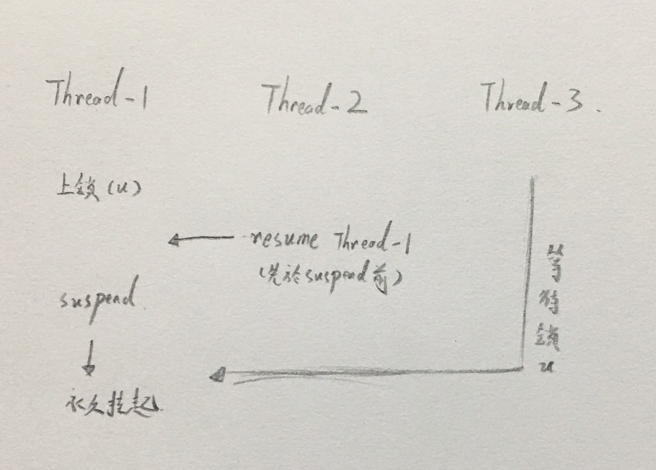
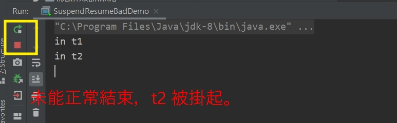

# 不要用 `suspend()` 與 `resume()`

<br>

-------

<br>

`suspend()` 掛起

 `resume()` 繼續執行

 <br>

 這兩個方法是一對相反的操作，被 `suspend()` 掛起的 Thread 必須等 `resume()` 後才能繼續執行。事實上，這兩個方法已經被 JDK 標註棄用了。

 具體原因是因為 `suspend()` 會導致 Thread 掛起同時並不會釋放任何資源。如果屆時其他 Thread 要訪問被他佔用的資源，會無法正常取得資源執行，直到對應 Thread 進行了 `resume()` 操作，讓被掛起的 Thread 繼續執行並釋放資源，其他卡住的 Thread 才能順利執行。

 問題來了，如果 `resume()` 提前於 `suspend()` 就執行了，那被掛起的 Thread 就無法繼續執行，那麼被占用的資源就無法釋放，其他 Thread 也會被影響。而且更嚴重的是，被掛起的 Thread 狀態居然還是 RUNNABLE，這會導致我們在 debug 時影響我們的判斷。\

 <br>

 以下用圖例說明一下這種情形發生經過：

 <br>

 

 <br>

 透過一個小範例再詳細看一下問題：

 <br>

 ```java
public class SuspendResumeBadDemo {

    public static final Object LOCK = new Object();


    public static class SuspendThread extends Thread {
        public SuspendThread(String name) {
            super.setName(name);
        }

        @Override
        public void run() {
            synchronized (LOCK) {
                System.out.println("in " + getName());
                Thread.currentThread().suspend();
            }
        }
    }

    public static void main(String[] args) throws InterruptedException {
        SuspendThread t1 = new SuspendThread("t1");
        SuspendThread t2 = new SuspendThread("t2");

        t1.start();
        Thread.sleep(200); // 保證讓 t1 先執行並掛起
        t2.start();
        t1.resume(); // t1 繼續執行結束任務並釋放 LOCK
        t2.resume(); // 執行這一段時，t2 還沒取得 LOCK，所以還未 suspend()
        t1.join();
        t2.join();
    }

}
 ```

 <br>

 看一下結果：

 <br>

 

 <br>

 透過 JDK 工具 jstack 看一下系統信息。

 <br>

 ```
D:\IDEA_WORKSPACE\Java-multi-thread-mysticism>jstack 11600

2022-05-31 10:39:43
Full thread dump OpenJDK 64-Bit Server VM (25.71-b10 mixed mode):

"t2" #13 prio=5 os_prio=0 tid=0x0000000021191800 nid=0x2a84 runnable [0x000000002205f000]
   java.lang.Thread.State: RUNNABLE
        at java.lang.Thread.suspend0(Native Method)
        at java.lang.Thread.suspend(Thread.java:1032)
        at com.frizo.lab.thread.mysticism.basicOperation.SuspendResumeBadDemo$SuspendThread.run(SuspendResumeBadDemo.java:17)
        - locked <0x000000075610bc10> (a java.lang.Object)

 ```

<br>

可以看到 t2 是被掛起的，但仍然處於 RUNNABLE 狀態。

<br>
<br>

如果要設計一個良好的 `suspend()` 與 `resume()` 可以利用 `wait()`
 與 `notify()` 實現。

 <br>

 ```java
public class SuspendResumeGudDemo {

    public static final Object LOCK = new Object();

    public static class SuspendThread extends Thread {
        private volatile boolean suspendme = false;

        public void suspendMe() {
            this.suspendme = true;
        }

        public void resumeMe() {
            this.suspendme = false;
            synchronized (this) {
                notify();
            }
        }

        @Override
        public void run() {
            while (true) {
                synchronized (this) {
                    while (suspendme) {
                        try {
                            wait();
                        } catch (InterruptedException ex) {
                            ex.printStackTrace();
                        }
                    }
                }

                synchronized (LOCK) {
                    System.out.println("in SuspendThread.");
                }
                Thread.yield();
            }
        }
    }

    public static class AnotherThread extends Thread {
        @Override
        public void run() {
            while (true) {
                synchronized (LOCK) {
                    System.out.println("in AnotherThread.");
                }
                Thread.yield();
            }
        }
    }

    public static void main(String[] args) throws InterruptedException {
        SuspendThread t1 = new SuspendThread();
        AnotherThread t2 = new AnotherThread();
        t1.start();
        t2.start();
        Thread.sleep(1000);
        t1.suspendMe();
        System.out.println("suspend t1 2 sec.");
        Thread.sleep(2000);
        System.out.println("resume t1.");
        t1.resumeMe();
    }

}
 ```

`wait()` 方法會讓 Thread 釋放持有鎖資源，所以不用擔心占用資源導致其他 Thread 不能正常執行的問題。