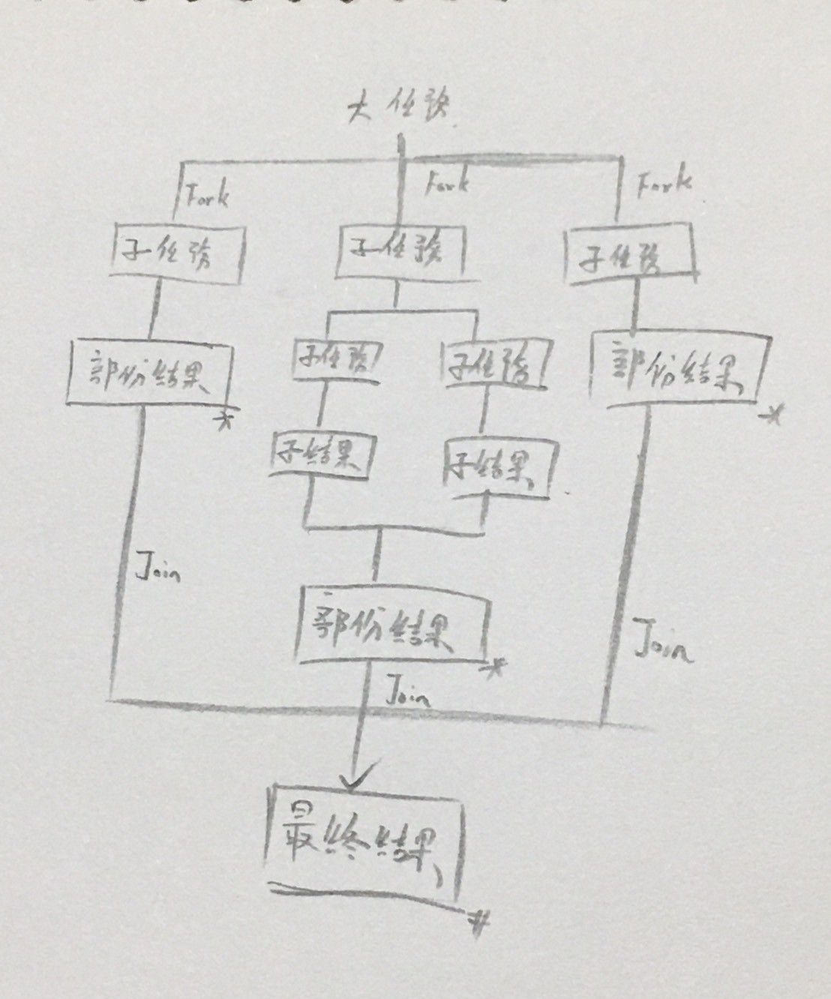
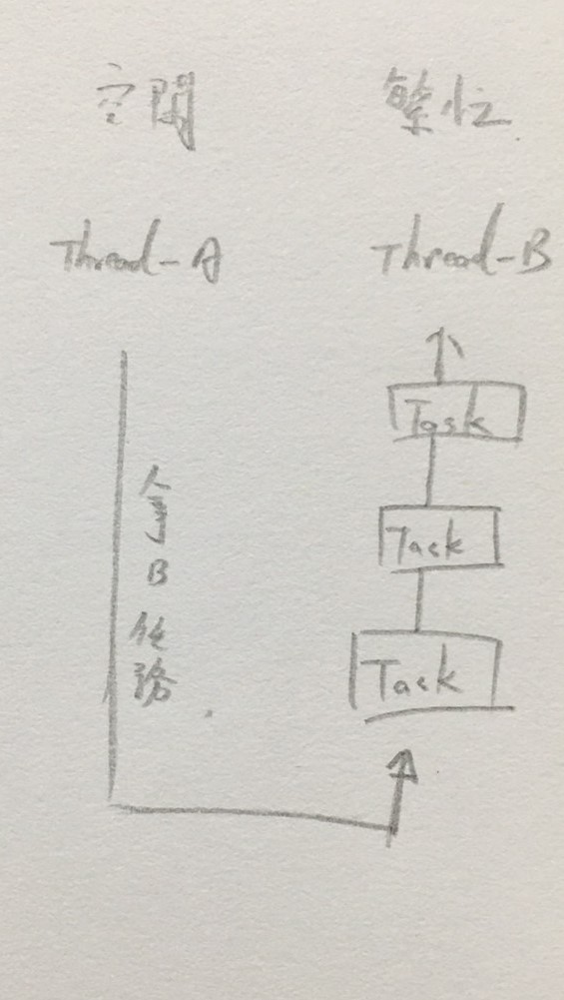

# Fork/Join 框架（MapReduce 思想）

<br>

---

<br>

Fork/Join 是一個非常有效處理大量資料的方法，MapReduce 也是採用分而治之的思想。簡單來說就是如果要處理 1000 筆資料，但我們並不具備一次處理 1000 筆資料的能力，那麼我們可以分支（__Fork__）其中 10 個，然後分階段處理 100 次，最後將 100 次處理結果合併（__Join__）。最終我們就得到這 1000 筆資料處理結果。

<br>

劃出 Fork/Join 圖示如下：

<br>



<br>

由於 ThreadPool 優化，提交的任務與 Thread 數量並不是一對一關係，每個 Thread 必須有一個任務隊列。因此，在實際執行的過程中，可能發生一種情況：Thread-A 已經把自己的任務都完成了，而 Thread-B 還有一堆任務排隊等待處理，此時 Thread-A 就會幫助 Thread-B，直接從 Thread-B 任務隊列的尾部拿一個任務來處理。

當 Thread 試圖幫助別人時，總是從隊列尾部開始取任務，而當 Thread 執行自己隊列任務時，是從頭部開始拿，這樣避免了資源競爭。

<br>

劃出圖示如下：

<br>



<br>

<br>

<br>

<br>

下面看一下 __ForkJoinPool__ 的一個重要方法：

<br>

```java
public <T> ForkJoinTask<T> submit(ForkJoinTask<T> task)
```

<br>

我們可以向 __ForkJoinPool__ 提交一個 __ForkJoinTask__（支持 `fork()` 分解以及 `join()` 等待的任務）

__ForkJoinPool__ 有兩個重要的子類：

* __RecursiveAction__：沒有 return 值的任務（void）。

* __RecursiveTask__：可以 return 值的任務（V）。

<br><br>

展示一個 Fork/Join 使用範例，計算和：

<br>

使用 __ForkJoinPool__ 構造一個計算 1 ~ 600000 的求和任務。

<br><br>

```java
public class CountTask extends RecursiveTask<Long> {

    private static final int THRESHOLD = 10000; // 最大可計算範圍
    private long start;
    private long end;

    public CountTask(long start, long end){
        this.start = start;
        this.end = end;
    }

    public Long compute() {
        long sum = 0;
        boolean canCompute = (end - start) < THRESHOLD;
        if (canCompute) {
            for (long i = start; i <= end; i++) {
                sum += i;
            }
        } else {
            long step = (start + end) / 100; // 大任務拆成 100 份，一個 step 為一個子任務需要處裡的量。
            ArrayList<CountTask> subTasks = new ArrayList<CountTask>();
            long position = start;
            for (int i = 0; i < 100; i++) {
                long lastOne = Math.min(position + step, end);
                CountTask subTask = new CountTask(position, lastOne);
                position += step + 1;
                subTasks.add(subTask);
                subTask.fork();
            }
            sum += subTasks.stream().mapToLong(ForkJoinTask::join).sum();
        }
        return sum;
    }

    public static void main(String[] args) {
        ForkJoinPool forkJoinPool = new ForkJoinPool();
        CountTask task = new CountTask(0, 600000L);
        ForkJoinTask<Long> result = forkJoinPool.submit(task);
        try{
            long res = result.get();
            System.out.println("sum = " + res);
        } catch (InterruptedException | ExecutionException e) {
            e.printStackTrace();
        }
    }
}
```

<br>

印出結果

<br>

```java
sum = 180000300000
```