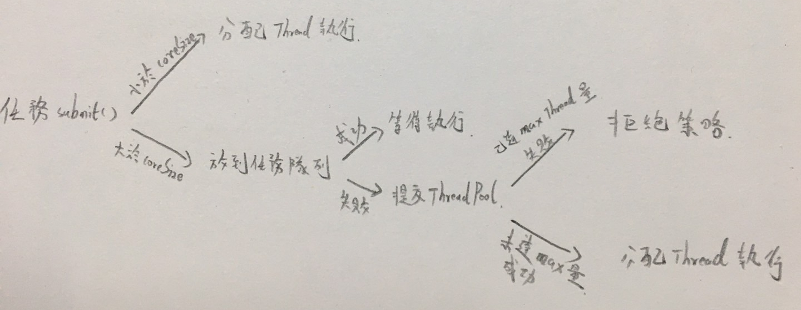

# 探究底層：ThreadPool 的內部實作

<br>

-------

<br>

無論使用 `newFixedThreadPool()` 還是 `newSingleThreadExecutor()` 或者 `newCachedThreadPool()`，看起來創建的 ThreadPool 有不同的功能特點，但事實上內部都使用了 __ThreadPoolExecutor__ 實現：

<br>

__Executors__ 部分原始碼：

```java
public static ExecutorService newFixedThreadPool(int nThreads) {
        return new ThreadPoolExecutor(nThreads, nThreads,
                                      0L, TimeUnit.MILLISECONDS,
                                      new LinkedBlockingQueue<Runnable>());
    }

public static ExecutorService newSingleThreadExecutor() {
        return new FinalizableDelegatedExecutorService
            (new ThreadPoolExecutor(1, 1,
                                    0L, TimeUnit.MILLISECONDS,
                                    new LinkedBlockingQueue<Runnable>()));
    }

public static ExecutorService newCachedThreadPool() {
        return new ThreadPoolExecutor(0, Integer.MAX_VALUE,
                                      60L, TimeUnit.SECONDS,
                                      new SynchronousQueue<Runnable>());
    }
```

<br>

可以看到，這些方法其實就是 __ThreadPoolExecutor__ 封裝。仔細分析一下 __ThreadPoolExecutor__ 的建構方法：

<br>

```java
public ThreadPoolExecutor(int corePoolSize,
                              int maximumPoolSize,
                              long keepAliveTime,
                              TimeUnit unit,
                              BlockingQueue<Runnable> workQueue,
                              ThreadFactory threadFactory,
                              RejectedExecutionHandler handler) {
    ...
                                  
}
```

<br>

* `corePoolSize`：指定 ThreadPool 中的 Thread 數量。

* `maximumPoolSize`：指定 ThreadPool 中最大上限 Thread 數量。

* `keepAliveTime`：當 ThreadPool 中 Thread 數量超過 corePoolSize 時，多出來空閒的 Thread 存活時間。

* `unit`：keepAliveTime 的單位。

* `workQueue`：任務隊列，被 `submit()` 但尚未被執行的任務。

* `threadFactory`：工廠類，用於建立 Thread，一般用默認就可以。

* `handler`：拒絕策略，當任務太多沒辦法處理，定義如何拒絕任務。

<br>

其中最為重要的一個參數是 `workQueue`。他是一個實作 __BlockingQueue__ 介面的物件，只能存放 __Runnable__ 物件。

根據隊列功能分類，ThreadPoolExecutor 可以使用以下 4 種 __BlockingQueue__：

<br>

1. __直接提交隊列__

    該功能由 __SynchronousQueue__ 物件提供，它是一個特殊的 __BlockingQueue__ 物件，__且沒有容量__。每一個插入操作都要等待一個刪除操作，反之亦然，一個刪除操作也要等一個插入操作。提交的任務不會被真實保存，且總是將新任務提交給 Thread 執行。如果沒有空閒 Thread 就嘗試建立新的，如果 Thread 數量已達到最大值則執行拒絕策略。因此，使用 __SynchronousQueue__ 通常要設置很大的 `maximumPoolSize`，否則很容易執行拒絕策略。

<br>

2. __有界任務隊列__

    有界任務隊列可以使用 __ArrayBlockingQueue__ 實現，它的建構式必須帶一個容量參數，表示隊列最大容量：

    ```java
    public ArrayBlockingQueue(int capacity)
    ```

    使用有界任務隊列時，當有新任務需要執行，如果 ThreadPool 中實際 Thread 數量小於 `corePoolSize` 則優先建立新 Thread，若大於 `corePoolSize` 則把新任務丟到等待隊列。若等待隊列中任務數量達到界線（滿了），在總 Thread 數量不大於 `maximumPoolSize` 前提下，建立新 Thread 執行任務。若大於 `maximumPoolSize` 則執行拒絕策略。

<br>

3. __無界任務隊列__

    無界任務隊列可以通過 __LinkedBlockingQueue__ 類別實現。與有界隊列的保守相比，無界隊列除非系統資源耗盡，否則不會存在任務入列失敗的情況。當有新任務來到，且 ThreadPool 中的 Thread 小於 `corePoolSize` 時，建立新的 Thread 執行任務，但當 ThreadPool 數量達到 `corePoolSize` 後，就不再繼續增加。若後續有新的任務加入，而又沒有空閒的 Thread 資源，則直接進隊列等待。__無界任務隊列會無上限增長，直到系統內存耗盡。__

<br>

4. __優先任務隊列__

    優先任務隊列是帶有執行優先級的隊列。它通過 __PriorityBlockingQueue__ 實現，可以控制任務執行先後順序。它是一種特殊 __無界任務隊列__。無論有界任務隊列的 __ArrayBlockingQueue__，還是無界任務隊列的 __LinkedBlockingQueue__，它們都是按照先進先出的規則處理任務。而 __PriorityBlockingQueue__ 則可以根據任務自身優先級順序先後執行，在確保系統性能同時，也可以很好的質量保證。

<br>
<br>
<br>
<br>

現在回頭看一下 __Executors__ 的工廠方法

<br>

* `newFixedThreadPool()` 方法返回一個 `corePoolSize` 與 `maximumPoolSize` 大小一樣，並使用 __LinkedBlockingQueue__ 任務隊列的 ThreadPool，因為對於固定大小的 ThreadPool 而言，不存在 Thread 數量的動態變化，因此 `corePoolSize` 與 `maximumPoolSize` 可以相等。同時它使用無界隊列存放無法立即執行的任務，當任務提交非常頻繁時，該隊列會迅速膨脹直到耗盡內存。

<br>

* `newSingleThreadExecutor()` 返回單一 Thread 的 ThreadPool，是 `newFixedThreadPool()` 的退化版，只是將 Thread 數量設定為 1。

<br>

* `newCachedThreadPool()` 方法返回 `corePoolSize` 為 0，`maximunPoolSize` 為 ∞ （無窮大）的 ThreadPool。這意味著在沒有任務時，該 ThreadPool 內無 Thread，當任務被 `submit()` 時，該 ThreadPool 會使先用空閒的（還未被銷毀）Thread 執行任務，如果剛好都沒有 Thread 了，則直接將任務加入 __SynchronousQueue__。上面有提到過，__SynchronousQueue__ 是直接提交任務隊列，它會強迫建立新的 Thread 執行任務，當任務執行完畢後，由於 `corePoolSize` 為 0，因此空閒 Thread 會在空閒 60 秒後銷毀。

如果大量任務提交給 `newCachedThreadPool()`，而任務執行速度不快，那系統會建立等量 Thread 處理，所以容易發生耗盡內存問題。

<br>
<br>
<br>
<br>

__ThreadPoolExecutor__ 核心調度邏輯：

<br>



